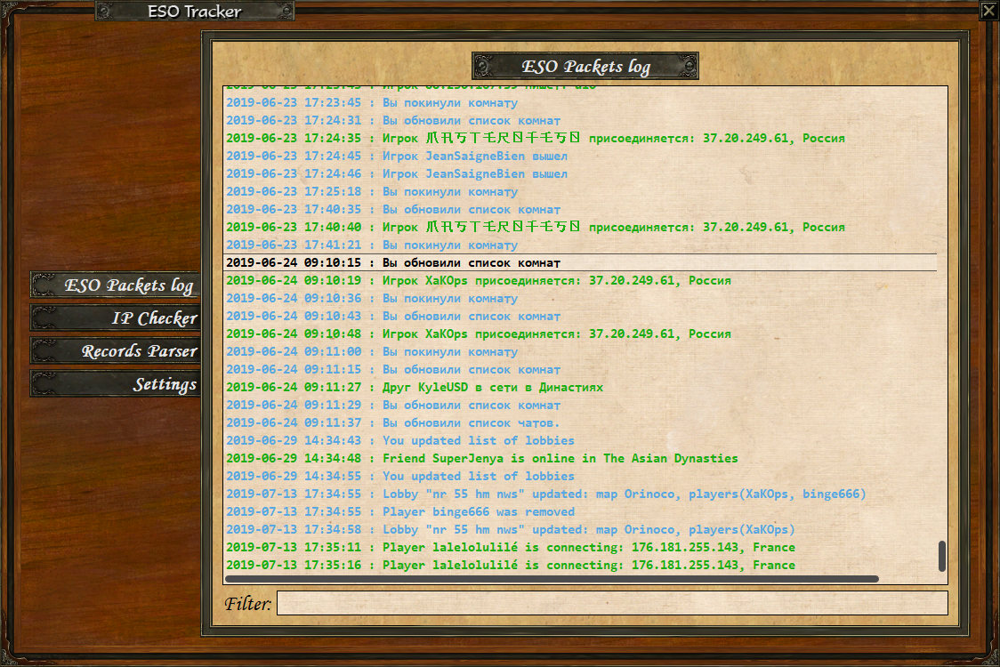

# ESO Packet Tracker
TCP (and part of UDP) Tracker for Age of Empires III

[](http://hits.dwyl.io/XaKOps/TCP-Tracker)




## Features

1. Shows all game TCP packets, formats it and saves to log file.
2. Text to Speech for important events like players connection, whisper and friends online notification.
3. Auto translate feature (translate messages to your system language).
4. IP Tracker.
5. IP and ESO database (stores localy on your PC).
6. Ping utility (you can see latency in milliseconds).
7. You can see and hear who whisper while you are ingame (use **/w name message** to answer in game chat).
8. You can see and hear friends online while you ingame.
9. You can see and hear lobby chat and taunts.
10. Finally you can copy text from chats.
11. App support Russian and English localiztion.

## How To Use .EXE file
1. [DOWNLOAD ALREADY COMPLIED .EXE](https://github.com/XaKOps/TCP-Tracker/raw/master/TCP%20Tracker.exe)
2. Download and Install [Npcap](https://nmap.org/npcap/) or [WinPcap](https://www.winpcap.org/install/)

*WinPcap has been the de facto standard library for packet capture and link-layer packet injection for over a decade. Many open source and commercial network tools use WinPcap for network access and filtering, but it has been unmaintained since 2013 and is no longer supported.
Npcap is the exciting and feature-packed update to the venerable WinPcap packet capture library. Building on the successful WinPcap legacy, Npcap brings increased speed, security, and Windows 10 support. All of WinPcap's packet capture and injection features are included, with a few great additions like raw 802.11 frame capture.*

3. Run it!

## How To Use .py Script

1. Download and Install latest [Python](https://www.python.org/downloads/)
2. Download and Install [Npcap](https://nmap.org/npcap/) or [WinPcap](https://www.winpcap.org/install/)
3. Install all packages via pip (python-dateutil, requests, pyqt5, gtts, googletrans, playsound, scapy)
4. Run it!


## How To Compile .EXE file yourself

1. Download this repository.
2. Follow steps from **How To Use**, but instead of install scapy via pip, install latetest dev version via git.
```
git clone https://github.com/secdev/scapy.git
cd scapy
python setup.py install
```  
3. Install pyInstaller via pip.
4. Run command line and do commands
```
cd path_to_repo
pyinstaller --onefile app.spec
```


## List of All Formatted Events
### Chats
* Chat leave
* Chat msg
* Enter to chat browser
* Chat join

### Games
* Get invite
* Lobby update
* Remove user
* Create lobby
* Remove/ leave/ cancel lobby
* Join to lobby

### Misc
* QuickSearch begin/ cancel
* Send invite
* Remove player from friends/foes list
* Add Player to friends/foes list
* Update friends/foes list
* Player stat
* Whispers
* List of lobbies
* ESO population
* Frineds online/ offline/ ingame
