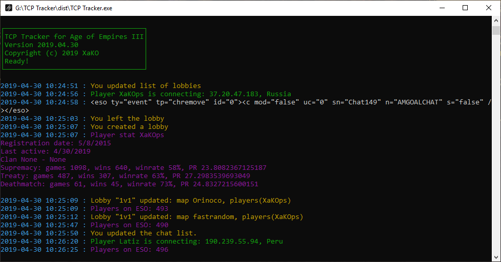

# TCP-Tracker
TCP Tracker for Age of Empires III

## How To Use

1. Download and Install latest [Python](https://www.python.org/downloads/)
2. Download and Install [Npcap](https://nmap.org/npcap/) or [WinPcap](https://www.winpcap.org/install/)
3. Install all packages via pip (python-dateutil, requests, colorama, gtts, playsound, scapy)
4. Run it!

[DOWNLOAD ALREADY COMPLIED .EXE](https://github.com/XaKOps/TCP-Tracker/raw/master/TCP%20Tracker.exe)

## How To Compile to .EXE file yourself

1. Download this repository.
2. Follow steps from **How To Use**, but instead of install scapy via pip, install latetest dev version via git.
```
git clone https://github.com/secdev/scapy.git
cd scapy
python setup.py install
```  
3. Install pyInstaller via pip.
4. Run command line and do commands
```
cd path_to_repo
pyinstaller --onefile tcp.spec
```




## Feautures

1. Shows all game TCP packets, formats it and saves to log file.
2. Text to Speech for important events like players connection, whisper and friends online.
3. IP Tracker.
4. You can see and hear who whisper while you are ingame (use **/w name message** to answer in game chat).
5. You can see and hear friends online while you ingame.
6. Finally you can copy text from chats.

## List of All Formatted Events
### Chats
* Chat leave
* Chat msg
* Enter to chat browser
* Chat join

### Games
* Get invite
* Lobby update
* Remove user
* Create lobby
* Remove/ leave/ cancel lobby
* Join to lobby

### Misc
* QuickSearch begin/ cancel
* Send invite
* Remove player from friends/foes list
* Add Player to friends/foes list
* Update friends/foes list
* Player stat
* Whispers
* List of lobbies
* ESO population
* Frineds online/ offline/ ingame
