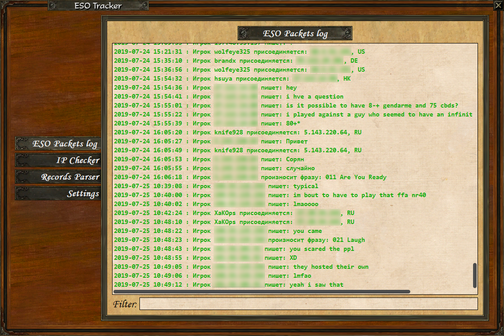
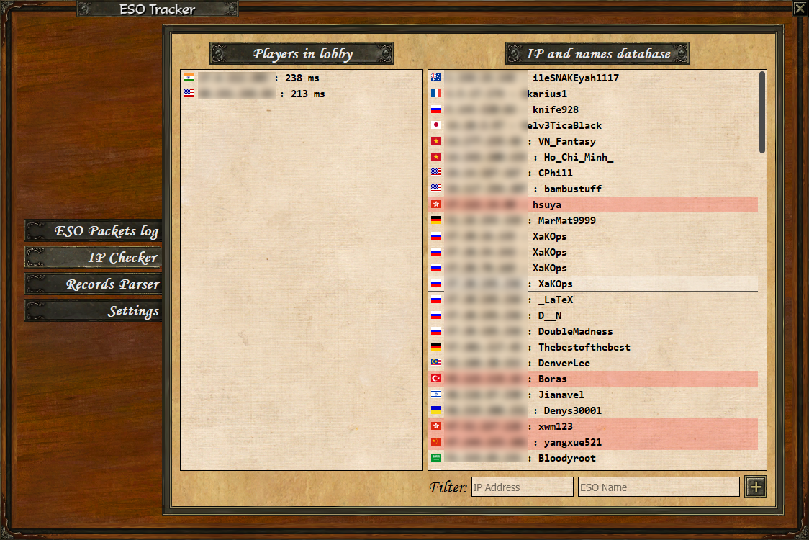

# ESO Tracker
It is a utility for **TRACKING** network **PACKETS** (TCP and UDP), **IP CHECKING** and **PARSING RECORDS** in Age of Empires III. The scope is quite wide: you can troll your mates, catch annoying smurfs or cheaters and analyse games. Convinient filters show only the information you want to see. App supports both Russian and English localization. View list of all [features](#Features).

## Download

[DOWNLOAD INSTALLER](https://drive.google.com/open?id=1EskTX8MirfWu2oTKtltgoXdze4EXlzM0)


If you don't trust installer then you can [compile .EXE file yourself](#How-To-Compile-.EXE-file-yourself). 


[](http://hits.dwyl.io/XaKOps/ESO-Tracker)

## Screenshots




## Features

1. [Packets Tracker](#Packets-Tracker)
2. [IP Checker](#IP-Checker)
3. [Records Parser](#Records-Parser)

### Packets Tracker
1. Shows all game TCP packets, formats it and saves to log file. View full [list of formatted events](#List-of-All-Formatted-Events).
2. Text to Speech for important events like players connection, whisper and friends online notification (convenient when game is minimized).
3. Auto translate feature (translate messages to your system language).
4. You can check player name in QuickSearch (only if you are host).
5. You can see and hear who whisper while you are ingame (use **/w name message** to answer in game chat).
6. You can see and hear friends online while you ingame.
7. You can see and hear lobby chat and taunts.
8. Finally you can copy text from chats.

### IP Checker
1. Simple IP geolocation shows country, city and flag.
2. IP and ESO names database (stores locally on your PC).
3. Ping utility (you can see latency in milliseconds).

### Records Parser
1. Shows general info about recorded game (title, map name, map icon, game mode, game version, game duration, players names, civs, PR and APM).
2. Shows selected decks.
3. Shows list of all important game actions(train units, build, shipment, spawn unit, research tech, selected deck, resigned, cheat tech) with timestamp.

## How To Compile .EXE file yourself

1. Download and Install latest [Python](https://www.python.org/downloads/)
2. Download and Install [Npcap](https://nmap.org/npcap/) or [WinPcap](https://www.winpcap.org/install/)
3. Install packages via pip (python-dateutil, requests, pyqt5, gtts, googletrans, playsound, pyInstaller)
4. Install latetest dev version of scapy via git:
```
git clone https://github.com/secdev/scapy.git
cd scapy
python setup.py install
```  
5. Download this repository.
6. Run command line and do commands^
```
cd path_to_repo
pyinstaller --onefile app.spec
```

## List of All Formatted Events
### Chats
* Chat leave
* Chat msg
* Enter to chat browser
* Chat join

### Games
* Get invite
* Lobby update
* Remove user
* Create lobby
* Remove/ leave/ cancel lobby
* Join to lobby

### Misc
* QuickSearch begin/ cancel
* Send invite
* Remove player from friends/foes list
* Add Player to friends/foes list
* Update friends/foes list
* Player stat
* Whispers
* List of lobbies
* ESO population
* Friends online/ offline/ ingame
